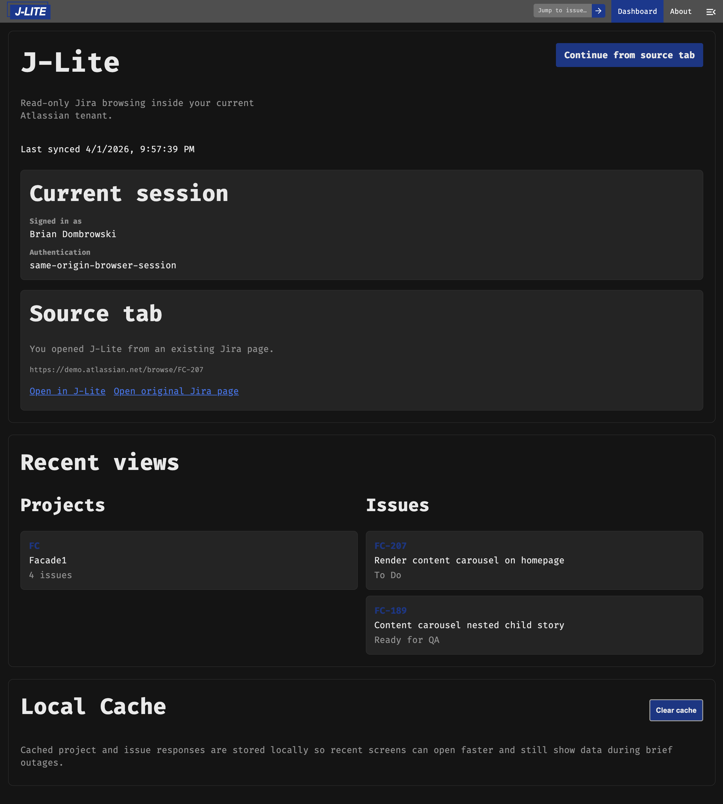

# J-Lite

J-Lite is an offline-friendly, lightweight Jira web portal packaged as a Chrome extension. The extension provides
an alternative Jira web experience for urls `*.atlassian.net/j-lite`. The extension gets data directly from the
Atlassian APIs and no data ever leaves your browser.

## Preview

Desktop-sized view of the dashboard (dark theme): header with jump-to-issue, session and source context, recent projects and issues, and local cache controls.



## Current feature set

- Dashboards for recently viewed, tasks, and projects
- Works from cache even if offline
- Proactively pre-caches issues visible in page

## Install

1. Download the latest `j-lite-v*.zip` from [Releases](https://github.com/bdombro/j-lite/releases/latest).
2. Unzip it to a folder you'll keep (e.g. `~/extensions/j-lite`).
3. Open `chrome://extensions` in Chrome.
4. Enable **Developer mode** (top-right toggle).
5. Click **Load unpacked** and select the unzipped folder.
6. Navigate to any Jira page, then click the J-Lite extension icon.

## Development

Install [just](https://github.com/casey/just), then:

```bash
just install
just start
```

`just` with no arguments prints available recipes. Common tasks:

- `just lint`
- `just test`
- `just build`
- `just storybook`

## Notes

- The older prototype lives in `jira-offline-remix/` and is used as a migration reference.
- The more detailed implementation rationale lives in `J_LITE_EXTENSION_PLAN.md`.
